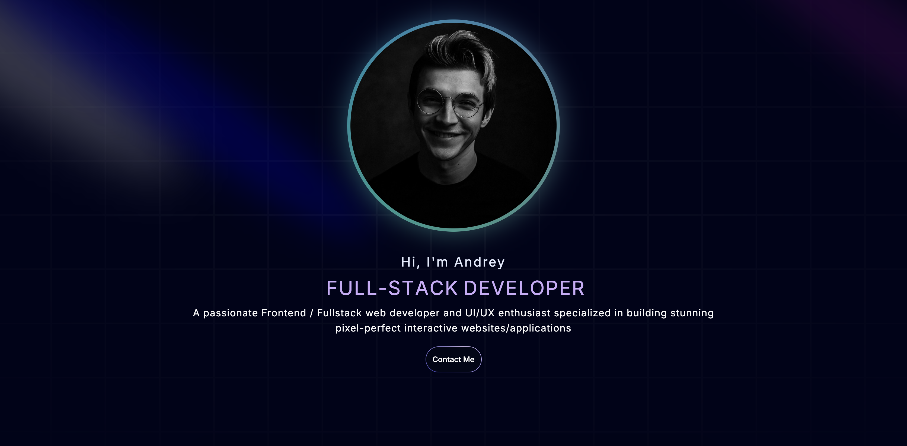
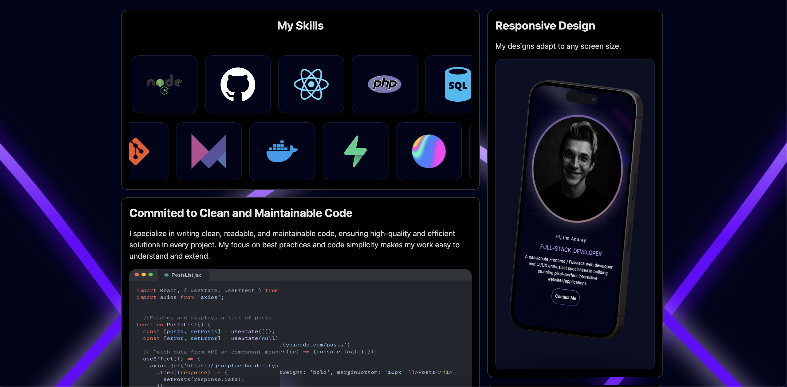
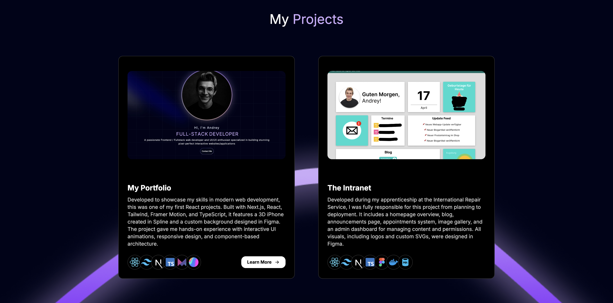

# Andrey Petkov - Full Stack Developer Portfolio

🌐 **Live Site**: [andrey-petkov.com](https://andrey-petkov.com)

A modern, interactive portfolio website showcasing my skills as a Full Stack Developer, built with cutting-edge web technologies and featuring stunning animations, responsive design, and an intuitive user experience.

## 🎯 Project Overview

This portfolio demonstrates my expertise in modern web development through a carefully crafted single-page application that highlights my projects, skills, and professional journey. Built with performance and user experience as top priorities, it features lazy loading, optimized images, and smooth animations throughout.

## 📸 Portfolio Sections

### Hero Section

*Interactive hero section with animated elements and call-to-action*

The landing section features:
- **Animated Introduction** with dynamic text effects
- **3D Interactive Elements** using Spline integration
- **Glassmorphism Design** with backdrop blur effects
- **Responsive Layout** optimized for all devices
- **Smooth Animations** powered by Framer Motion

### Skills & Technologies

*Bento grid layout showcasing skills and capabilities*

This section includes:
- **Bento Grid Layout** with interactive cards
- **Technology Marquee** featuring 21+ programming languages and tools
- **Hover Effects** with smooth scaling animations
- **Lazy Loading** for optimal performance
- **Skills Visualization** with custom animations

### Professional Journey

*Timeline and experience showcase*

Features include:
- **Professional Timeline** with interactive elements
- **Experience Cards** detailing my apprenticeship and growth
- **Sticky Scroll Animations** for engaging storytelling
- **Background Gradients** with custom styling
- **Responsive Design** for mobile and desktop

### Project Showcase

*Interactive project cards with detailed information*

Project section offers:
- **3D Project Cards** with tilt and hover effects
- **Technology Tooltips** showing tech stack for each project
- **Live Demo Links** to GitHub repositories
- **Responsive Grid Layout** adapting to screen sizes
- **Project Categories** including web dev, blockchain, and game development

## 🚀 Tech Stack

### Frontend
- **Next.js 14** - React framework with App Router
- **TypeScript** - Type-safe development
- **Tailwind CSS** - Utility-first CSS framework
- **Framer Motion** - Advanced animations and interactions

### UI/UX
- **Custom Components** - Reusable and modular design system
- **Glassmorphism Effects** - Modern visual design
- **Responsive Design** - Mobile-first approach
- **Accessibility** - WCAG compliant components

### Performance
- **Image Optimization** - Next.js Image component with lazy loading
- **Bundle Splitting** - Dynamic imports for faster load times
- **SEO Optimization** - Meta tags and Open Graph protocol
- **Font Optimization** - Google Fonts with display swap

### Development Tools
- **ESLint** - Code linting and quality
- **Git** - Version control
- **Vercel** - Deployment and hosting

## 🛠️ Key Features

- ⚡ **Lightning Fast** - Optimized loading with lazy components
- 📱 **Fully Responsive** - Works perfectly on all devices
- 🎨 **Modern Design** - Contemporary UI with smooth animations
- ♿ **Accessible** - Built with accessibility best practices
- 🔍 **SEO Optimized** - Meta tags and structured data
- 🚀 **Performance Focused** - Core Web Vitals optimized
- 💫 **Interactive** - Engaging user experience throughout

## 🏃‍♂️ Getting Started

### Prerequisites
- Node.js 18+ 
- npm or yarn package manager

### Installation

1. **Clone the repository**
   ```bash
   git clone https://github.com/ASTROFO7/Portfolio.git
   cd Portfolio
   ```

2. **Install dependencies**
   ```bash
   npm install
   # or
   yarn install
   ```

3. **Run development server**
   ```bash
   npm run dev
   # or
   yarn dev
   ```

4. **Open your browser**
   Navigate to [http://localhost:3000](http://localhost:3000)

### Build for Production

```bash
npm run build
npm start
```

## 📁 Project Structure

```
portfolio/
├── app/                    # Next.js App Router
│   ├── globals.css        # Global styles
│   ├── layout.tsx         # Root layout with metadata
│   └── page.tsx          # Main page with lazy loading
├── src/
│   ├── components/        # Reusable React components
│   │   ├── ui/           # UI components (buttons, cards, etc.)
│   │   ├── sections/     # Page sections (Hero, Projects, etc.)
│   │   └── layout/       # Layout components (Header, Footer)
│   ├── constants/        # Static data and configuration
│   ├── types/           # TypeScript type definitions
│   └── utils/           # Utility functions
├── public/
│   ├── images/          # Optimized images
│   └── LOGOS/          # Technology logos for marquee
└── README.md
```

## 🎨 Design Philosophy

This portfolio embodies modern web design principles:

- **Minimalist Aesthetic** - Clean, focused layouts
- **Motion Design** - Purposeful animations that enhance UX
- **Typography** - Carefully selected fonts and text hierarchy
- **Color Psychology** - Strategic use of color for visual impact
- **User-Centered** - Intuitive navigation and interaction patterns

## 🌟 Notable Implementations

- **Custom Heart Animation** - Interactive glowing stars that form a heart on hover
- **3D Project Cards** - Tilt effects and depth for project showcase
- **Technology Marquee** - Infinite scrolling with 21+ tech logos
- **Glassmorphism UI** - Modern frosted glass effects throughout
- **Progressive Loading** - Optimized performance with smart lazy loading

## 📞 Contact & Links

- **Website**: [andrey-petkov.com](https://andrey-petkov.com)
- **GitHub**: [@ASTROFO7](https://github.com/ASTROFO7)
- **Email**: Contact form available on the website

## 📄 License

This project is open source and available under the [MIT License](LICENSE).

---

Built with ❤️ by Andrey Petkov | © 2024
